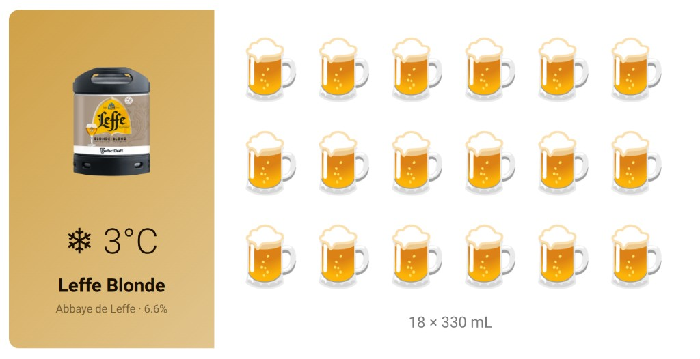

# PerfectDraft Card

A custom Lovelace card for the [PerfectDraft Pro Home Assistant integration](https://github.com/Falkvinge/hassio-integration-perfectdraft-pro). Displays your keg status at a glance — what beer is on tap, its temperature, and how many glasses remain — using a beer emoji pictogram.

Designed and optimised for the Sonoff NSPanel Pro 120 in landscape mode, but works on any HA dashboard.



## Features

- **Five layouts** — landscape, portrait, compact, hero, or single-vessel gauge; choose what fits your dashboard (defaults to landscape, so existing cards are unchanged)
- **Beer emoji pictogram** — see how many glasses remain in your keg at a glance, in a grid that shrinks to fit narrow cards
- **Automatic beer detection** — the card reads the tapped keg from the integration and shows the right beer on its own; nothing to select
- **Built-in beer catalog** — every keg the integration can identify, 68 with real keg photos; brand-tinted fallback art for the rest so every beer looks intentional
- **Glass size selector** — tap the emoji zone to choose between 250 mL, 330 mL, 500 mL, UK pint, or US pint
- **Freshness warnings** — escalating CSS-animated alerts as your keg approaches its 30-day expiry
- **UI-driven configuration** — no YAML editing required; everything is set up through the visual card editor

## Requirements

- [PerfectDraft Pro integration](https://github.com/Falkvinge/hassio-integration-perfectdraft-pro) **0.4.0 or later**, installed and configured — the card reads the keg sensors added in that release
- Home Assistant 2024.8 or later

## Installation

### HACS (recommended)

1. Open HACS → Frontend
2. Click the three dots menu → **Custom repositories**
3. Add `https://github.com/Falkvinge/hassio-component-perfectdraft-pro` with category **Dashboard**
4. Search for "PerfectDraft Card" and install it
5. Refresh your browser

### Manual

1. Download `perfectdraft-card.js` from the [latest release](https://github.com/Falkvinge/hassio-component-perfectdraft-pro/releases)
2. Copy it to your Home Assistant `config/www/perfectdraft-card/` directory
3. Go to **Settings → Dashboards → Resources** and add `/local/perfectdraft-card/perfectdraft-card.js` as a JavaScript Module
4. Refresh your browser

## Configuration

**No YAML editing required.** Add the card through the HA dashboard UI:

1. Edit your dashboard → Add Card → search for "PerfectDraft Card"
2. The editor auto-discovers your PerfectDraft device(s)
3. Pick your glass size and layout
4. Done! The beer is detected automatically from the keg in your machine.

### Beer detection

The card identifies the tapped beer from the integration's keg sensors, matching
on the keg's product ID first and its reported name second. When no keg is
tapped, the card says so rather than showing a beer.

If your keg is not recognised, or is shown as the wrong beer, set **Beer
override** in the card editor (or `beer_name` in YAML). That wins over detection.
Reports of unrecognised kegs are welcome as issues — the fix is usually a
one-line catalog addition.

### YAML reference (for power users)

```yaml
type: custom:perfectdraft-card
device_id: "perfectdraft_pro"
glass_size: 330
layout: landscape                 # landscape | portrait | compact | hero | vessel
# beer_name: "Leffe Blonde"       # override auto-detection; normally leave unset
# matrix_columns: auto            # "auto" or a fixed number of emoji columns
# max_matrix_width: "480px"       # cap + centre the emoji grid on wide cards
# custom_beers:
#   - name: "My Homebrew IPA"
#     brewery: "Home"
#     color_primary: "#4A7C2E"
#     color_secondary: "#F0F7E8"
#     image_url: "/local/images/my-ipa.png"
```

### On-card interactions

| Action | What happens |
|--------|-------------|
| Tap the **right zone** (emoji grid) | Opens glass size selection dialog |

The beer is detected rather than chosen, so the label zone is display-only. Your
glass size choice persists in your browser across page refreshes.

## Layouts

Set `layout` (or pick it in the visual editor) to match where the card lives:

| Layout | Best for |
|--------|----------|
| `landscape` (default) | Wall panels (NSPanel Pro), wide cards — label left, emoji grid right |
| `portrait` | Phones and tall/narrow columns — label on top, grid below |
| `compact` | Dense dashboards — a single row with a remaining-beer bar |
| `hero` | Showing off the beer — full-bleed keg photo with status overlaid |
| `vessel` | A calm single glass that fills to show how much is left |

The emoji grid is width-tolerant: it shrinks to fit narrow cards instead of overflowing. Power users can force a column count with `matrix_columns` or cap/centre the grid with `max_matrix_width`.

## Supported glass sizes

| Size | Description |
|------|-------------|
| 250 mL | Small glass |
| 330 mL | Bottle / standard |
| 500 mL | Half litre |
| 568 mL | Pint (UK) |
| 473 mL | Pint (US) |

## Sensor entities used

The card reads these sensors from the PerfectDraft integration:

| Sensor | Used for |
|--------|----------|
| `*_temperature` | Beer temperature display |
| `*_keg_remaining` | Glasses remaining calculation |
| `*_keg_freshness` | Freshness warning system |
| `*_keg_product` | Identifying the tapped beer (product ID match) |
| `*_keg` | Identifying the tapped beer (name match fallback) |

The last two arrive with integration 0.4.0. If they are missing, the card tells
you to update the integration instead of guessing at a beer.

## License

This project was AI-generated. Human involvement did not meet the bar for substantial originality required for copyright protection. This work is in the public domain where applicable, or otherwise not subject to copyright protection.
